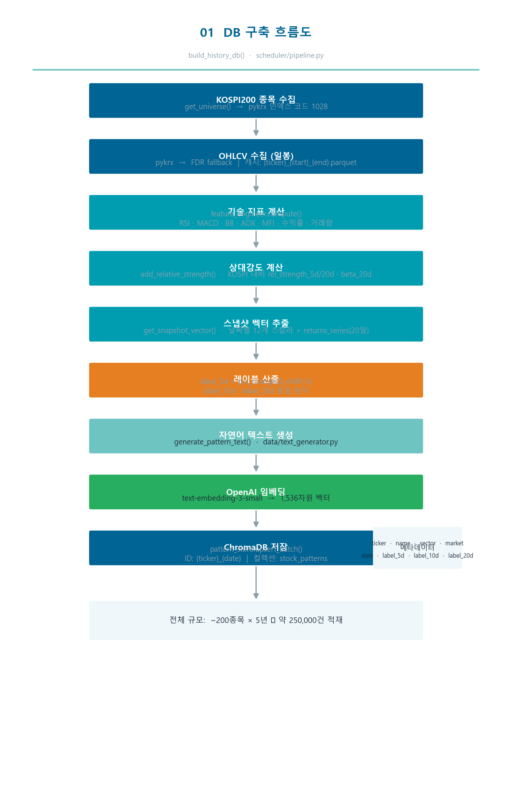
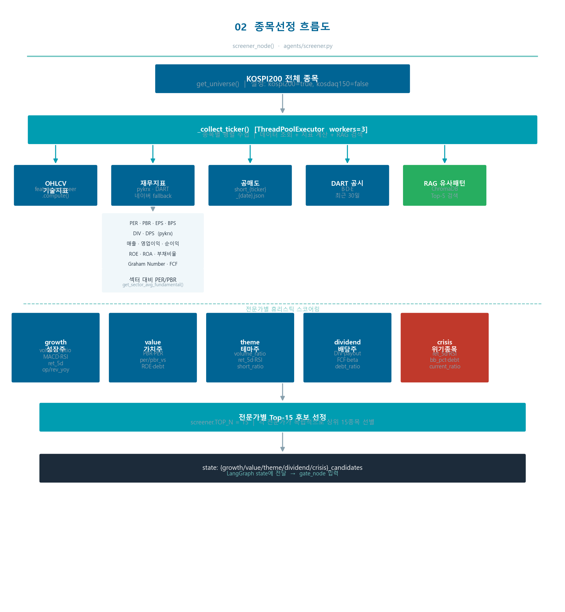
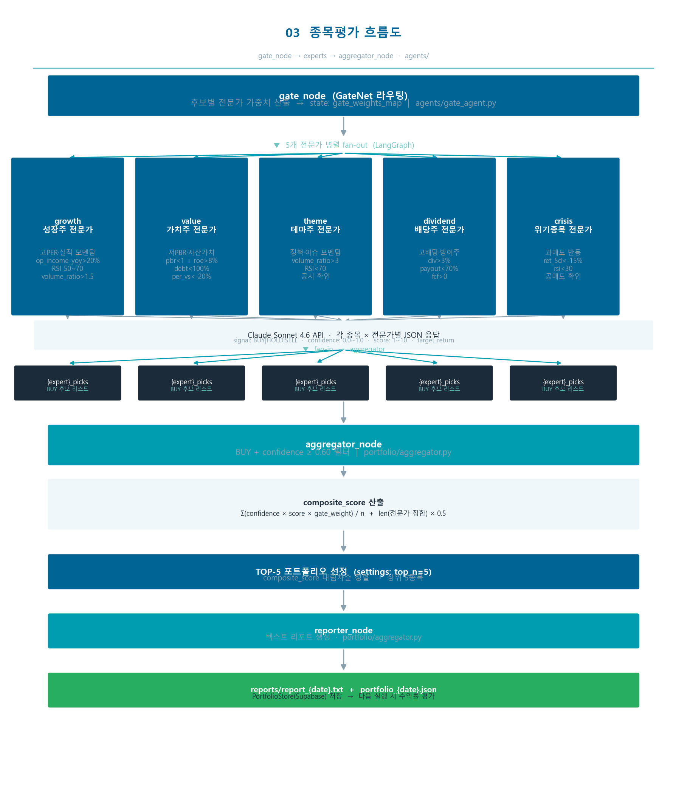

# 데이터 아키텍처 가이드

## 1. 데이터 유형 구분

| 유형 | 저장 위치 | 수집 시점 | 용도 |
|------|----------|----------|------|
| **RAG 저장 데이터** | ChromaDB (stock_patterns) | `build_db` 1회 + `run` 시 당일 추가 | 유사 과거 패턴 검색 |
| **실시간 데이터** | 메모리 (캐시 활용) | `run` 실행 시마다 조회 | 전문가 에이전트 분석 |

---

## 2. RAG 저장 데이터 (ChromaDB)

### 2.1 컬렉션 구성

| 컬렉션 | 상태 | 용도 |
|--------|------|------|
| `stock_patterns` | **사용 중** | 주가 패턴 임베딩 + 수익률 레이블 |

### 2.2 저장 구조 (1건 = 특정 종목의 특정 날짜 스냅샷)

| 필드 | 타입 | 내용 | 예시 |
|------|------|------|------|
| **ID** | string | `{ticker}_{날짜}` | `005930_2024-03-15` |
| **Text** | string | 기술지표 자연어 텍스트 (임베딩 원본) | 아래 참고 |
| **Embedding** | float[1536] | OpenAI text-embedding-3-small 벡터 | - |
| **label_5d** | string | 5거래일 후 실제 수익률 | `"0.032"` |
| **label_10d** | string | 10거래일 후 실제 수익률 | `"0.051"` |
| **label_20d** | string | 20거래일 후 실제 수익률 | `"0.078"` |
| **ticker** | string | 종목코드 | `"005930"` |
| **name** | string | 종목명 | `"삼성전자"` |
| **sector** | string | 섹터 | `"반도체"` |
| **market** | string | 시장 | `"KOSPI"` |
| **date** | string | 기준일 | `"2024-03-15"` |

**Text 필드 예시:**
```
종목: 005930 삼성전자 | 시장: KOSPI | 섹터: 반도체
수익률: 5일+3.2% 20일+8.5%
추세: 강한상승추세 | MA20대비+5.2% MA60대비+8.1%
RSI: 65(강세) | MACD: 골든크로스/상승세
볼린저: 상단대(0.72) | 거래량: 급증(2배+)
역사적변동성(20일): 18.3% | ADX: 28 | MFI: 62
이후5일수익률: +3.2%
```

### 2.3 수집 출처 및 흐름

```
pykrx → FDR fallback
        ↓
  OHLCV 일봉 데이터
        ↓
  feature_engineer.py
  (RSI, MACD, BB, ADX, MFI + label_5d·10d·20d 계산)
        ↓
  text_generator.py
  (수치 → 자연어 텍스트 변환)
        ↓
  embedder.py
  (OpenAI API → 1,536차원 벡터)
        ↓
  ChromaDB (stock_patterns)
```

| 데이터 | 수집처 | 비고 |
|--------|--------|------|
| OHLCV (시가·고가·저가·종가·거래량) | pykrx → FDR fallback | 일별 캐시 |
| RSI, MACD, BB, ADX, MFI | feature_engineer.py 자체 계산 | - |
| label_5d·10d·20d | OHLCV에서 계산 | `close.pct_change(N).shift(-N)` |
| 임베딩 벡터 | OpenAI API | text-embedding-3-small |



### 2.4 구축 / 갱신 시점

| 명령 | 대상 | 샘플링 | 규모 |
|------|------|--------|------|
| `--mode build_db` | 전체 200종목 × 3년 | 모든 거래일 | ~150,000건 |
| `--mode run` | 오늘 날짜 200종목 | 당일 1건씩 | 200건 추가 |

---

## 3. 실시간 데이터 (`run` 실행 시 조회)

`run_daily()` → `screener_node()` → `_collect_ticker()` 에서 종목당 수집

### 3.1 기술지표 Snapshot — 수집처: pykrx → FDR

`feature_engineer.get_snapshot_vector()`로 당일 기준 계산

| 지표 | 설명 |
|------|------|
| `ret_1d / ret_5d / ret_20d / ret_60d` | 기간별 수익률 |
| `rsi` | RSI-14 |
| `macd_diff` | MACD - Signal |
| `bb_pct` | 볼린저밴드 %B |
| `volume_ratio` | 거래량 / 20일 평균 거래량 |
| `hist_vol_20` | 20일 역사적 변동성 |
| `close_to_ma20 / close_to_ma60` | 이동평균 대비 위치 |
| `adx` | ADX (추세 강도) |
| `mfi` | MFI-14 (자금흐름) |
| `beta_20d` | 20일 베타 (KOSPI 대비) |
| `rel_strength_5d` | KOSPI 대비 5일 상대수익률 |
| `rel_strength_20d` | KOSPI 대비 20일 상대수익률 |

### 3.2 재무지표 Financials — 수집처: pykrx·DART·네이버

| 항목 | 수집처 | 캐시 |
|------|--------|------|
| PER, PBR, EPS, BPS, DIV, DPS | pykrx `get_market_fundamental()` → 네이버 금융 fallback | 월별 |
| 매출·영업이익·순이익 (당기·전기) | DART `finstate_all()` | 월별 |
| ROE, ROA | DART 재무제표 계산 | 월별 |
| 부채비율, 유동비율, 이자보상배율 | DART 재무제표 계산 | 월별 |
| FCF, OCF | DART 재무제표 계산 | 월별 |
| 매출YoY, 영업이익YoY, 순이익YoY | DART 당기/전기 비교 | 월별 |
| Graham Number | `√(22.5 × EPS × BPS)` 자체 계산 | - |
| 배당성향 | `DPS / EPS × 100` 자체 계산 | - |
| 섹터 대비 PER/PBR | `get_sector_avg_fundamental()` | 월별 |
| 공매도비율 | KRX `get_shorting_data()` | 일별 |
| 52주 고저점 대비 | pykrx → FDR OHLCV 계산 | - |
| 시가총액 | pykrx → FDR (`mktcap` 컬럼) | 일별 |
| 현재가 | pykrx → FDR (최근 종가) | 일별 |

### 3.3 공시 News — 수집처: DART API

`collector.get_recent_filings(ticker, days=30, ref_date=분석날짜)`

- **분석 날짜 기준** 30일 전 ~ 분석 날짜 공시 조회 (백테스트 미래 정보 유출 방지)
- 제목(`report_nm`)·날짜(`rcept_dt`)만 수집, 본문 미포함
- 최신순 Top-5 반환

**수집 공시 종류 (정기보고서 제외):**

| kind | 분류 | 예시 |
|------|------|------|
| `B` | 주요사항보고서 | 유상증자, 전환사채, 합병·분할, 자기주식 취득 |
| `D` | 지분공시 | 최대주주 변경, 임원 주식 매매 |
| `E` | 기타공시 | 불성실공시, 횡령·배임, 조회공시 |

> `kind="A"` 정기공시(분기보고서, 사업보고서)는 투자 신호로서 의미가 낮아 제외

**전문가별 공시 활용 가이드:**

| 전문가 | BUY 가산점 | confidence 하향 |
|--------|-----------|----------------|
| growth | 수주·계약 체결 | 유상증자(희석), 전환사채 |
| value | 자기주식 취득 | 전환사채·유상증자(BPS 희석) |
| theme | 수주·MOU, 조회공시 확인 | 불성실공시 |
| dividend | 배당 결정·증액 | 유상증자, 최대주주 변경 |
| crisis | 조회공시(일시적 악재) | 횡령·배임, 긴급 유상증자 |

### 3.4 RAG 유사패턴 — 수집처: ChromaDB

`pattern_store.query(current_embedding, top_k=5)`

#### 유사도 계산 방식

현재 종목의 기술지표 텍스트를 임베딩 벡터로 변환한 뒤, ChromaDB에 저장된 과거 패턴 벡터들과 **코사인 유사도**를 계산합니다.

```
현재 패턴 텍스트
        ↓
OpenAI text-embedding-3-small
        ↓
1,536차원 벡터
        ↓
ChromaDB 코사인 유사도 검색 (hnsw:space = cosine)
        ↓
과거 ~150,000건 벡터와 비교 → Top-5 반환
```

**코사인 유사도:**
```
유사도 = cos(θ) = (A·B) / (|A| × |B|)

1.0 → 완전히 같은 패턴
0.0 → 전혀 다른 패턴
```

반환되는 `distance`는 코사인 거리(1 - 유사도)이므로, 화면에 표시할 때 `(1 - distance) × 100 = 유사도%`로 변환합니다.

**유사도 예시:**
```
현재: RSI:68 거래량:2.3배 MACD:양전환 5일+3.2%
         ↕ 유사도 94%
과거: RSI:65 거래량:2.1배 MACD:양전환 5일+2.8% → 20일후 +8.2%
```

RSI, 거래량비율, MACD, 수익률 등 **수치 패턴의 조합**이 비슷할수록 유사도가 높으며, OpenAI 임베딩 모델이 의미적으로 유사한 패턴을 가까운 벡터 공간에 배치합니다.

#### RAG → Confidence 연동

```
[유사 과거 패턴 (RAG/20일 수익률)]
  1. 유사도:94% → 20일후:+8.2%
  2. 유사도:91% → 20일후:+5.1%
  3. 유사도:88% → 20일후:-2.3%
  4. 유사도:85% → 20일후:+6.7%
  5. 유사도:83% → 20일후:+3.4%
  적중률:4/5 | 평균수익:+4.2%
```

- 적중률 4/5 이상 + 평균수익 플러스 → 전문가 confidence **상향**
- 적중률 2/5 이하 또는 평균수익 마이너스 → 전문가 confidence **하향 / HOLD**
- `--horizon weekly` 시 `label_5d` 기준, `--horizon monthly`(기본) 시 `label_20d` 기준

---



## 4. 전문가별 사용 데이터 요약

| 전문가 | 주요 판단 데이터 | 공시 | RAG 레이블 |
|--------|----------------|------|-----------|
| **growth** | 매출YoY·영업이익YoY·EPS·RSI·거래량·공매도 | ✅ | label_20d |
| **value** | PBR·PER·Graham Number·ROE·ROA·FCF·부채비율 | ✅ | label_20d |
| **theme** | RSI·거래량비율·52주고점 | ✅ | label_20d |
| **dividend** | 배당수익률·DPS·배당성향·FCF·OCF·베타 | ✅ | label_20d |
| **crisis** | 5일수익률·RSI·BB위치·부채비율·유동비율 | ✅ | label_20d |

---

## 5. 캐시 구조

### 5.1 캐시를 사용하는 이유

**200종목을 매 실행마다 외부 API에서 조회하면:**
- OHLCV: 200종목 × API 호출 → 수 분 소요
- 재무지표: DART + pykrx 호출 → API 속도 제한(Rate Limit) 도달
- 총 실행 시간: 캐시 없으면 **30분+**, 캐시 있으면 **7분 내**

**캐시가 해결하는 문제:**

| 문제 | 캐시 해결 방식 |
|------|--------------|
| 동일 날짜 반복 조회 | 파일 존재 시 API 호출 없이 즉시 반환 |
| API Rate Limit | 하루 1회 조회 후 캐시, 이후 재사용 |
| 외부 API 장애 | 이전 캐시 데이터로 fallback 가능 |
| 백테스트 속도 | 과거 날짜 데이터 재사용으로 반복 실행 빠름 |

### 5.2 캐시 파일 구조

```
cache/
├── {ticker}_{start}_{end}.parquet   # OHLCV (날짜 바뀌면 재다운로드)
├── fin_{ticker}_{YYYYMM}.json       # 재무지표 (월별 — 같은 달 재사용)
├── filings_{ticker}_{YYYYMMDD}.json # 공시 (일별 — 같은 날짜 재사용)
├── sector_map.parquet               # 섹터 매핑 (7일 유효)
└── short_{ticker}_{date}.json       # 공매도 (일별)
```

**캐시 유효 기간:**

| 파일 | 유효 기간 | 이유 |
|------|----------|------|
| OHLCV `.parquet` | 날짜 변경 시 재다운로드 | 매일 새 데이터 추가 |
| 재무지표 `.json` | 월별 (같은 달 재사용) | 분기 실적은 월 단위 변경 |
| 공시 `.json` | 일별 (같은 날짜 재사용) | 백테스트 반복 실행 시 DART 중복 호출 방지 |
| 섹터 매핑 `.parquet` | 7일 | 섹터 변경이 드뭄 |
| 공매도 `.json` | 일별 | 매일 변동 |

---

## 6. 전체 데이터 흐름

```
외부 데이터 소스
├── pykrx / FDR     → OHLCV, 지수, PER/PBR/EPS/BPS/DIV
├── 네이버 금융 API → PER/PBR fallback
├── DART API        → 재무제표, 공시(B·D·E)
├── KRX             → 공매도 비율
└── OpenAI API      → 텍스트 임베딩

     ┌─────────────────┬────────────────────────┐
     ↓                 ↓
[RAG 저장]         [실시간 조회 (run 시)]
ChromaDB            screener_node
stock_patterns       ├─ snapshot (기술지표)
├─ text              ├─ financials (재무지표)
├─ embedding         ├─ news_text (공시 B·D·E)
└─ metadata          └─ retrieved_patterns (ChromaDB)
   label_5d·10d·20d
                     ↓
             [GateNet 라우팅 (gate_node)]
             후보별 전문가 가중치 산정 → gate_weights_map
                     ↓
             [5개 전문가 병렬 실행]
             growth / value / theme / dividend / crisis
             (snapshot + financials + 공시 + RAG → Claude LLM)
                     ↓
             aggregator (GateNet 가중치 반영) → 포트폴리오 (TOP-5, confidence ≥ 0.60)
```


